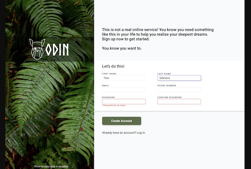
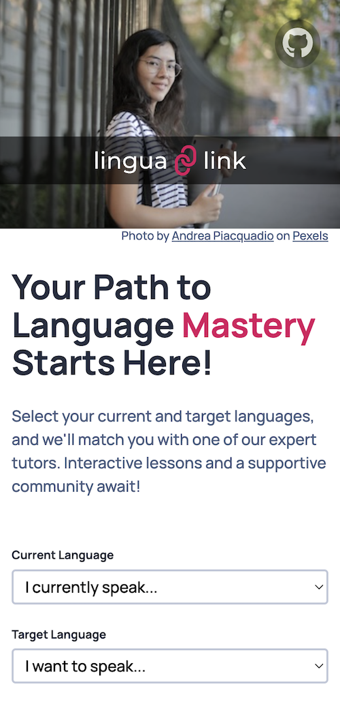

# LinguaLink

This project is part of the Odin Project curriculum. The objective is to create a sign-up form for an imaginary service, applying HTML, CSS, and JavaScript skills learned in previous lessons.

Form validation is a critical component of this project, ensuring that users provide accurate and complete information before submitting the form. Custom validations were implemented using JavaScript to verify the input fields, including checking for non-empty fields, validating email formats, enforcing password complexity, and matching passwords. These validations not only enhance the security and integrity of the data but also improve user experience by providing immediate feedback and guiding users to correct errors in their submissions.

## Customization

A design file was provided as part of the assignment to give a general idea for the layout of the form. I customized my version of the sign-up form using a fictitious online language tutoring service called LinguaLink. The customization includes:

- Logo and Branding: Unique logo and color scheme.
- Background Image: Selected a background image from Pexels to fit the theme.
- Fonts: Chose an external font that aligns with the brand identity.
- Content: Modified text content to reflect the services offered by LinguaLink.

## Screenshots

My solution:

Design Template from the Assignment:

Although it wasn't a requirement for the assignment, I adopted a mobile-first approach and used media queries to ensure the design is responsive across various devices.

## Credits

- Background Image: Photo by [Andrea Piacquadio](https://www.pexels.com/@olly/) on [Pexels](https://www.pexels.com/)

This project is a part of the [Odin Project](https://www.theodinproject.com/) curriculum.
